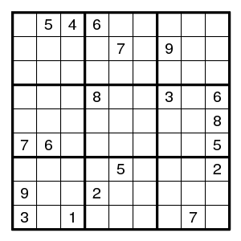
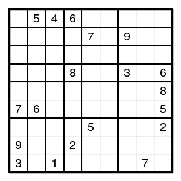
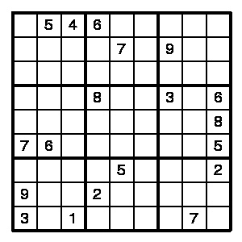
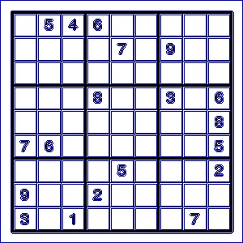

# prueba_soduku
 El objetivo de este repositorio es detectar las casillas de un sudoku que contienen un número

## Codigo
### Prueba 1
Esta prueba consiste en localizar cuales son las casillas que contienen un numero

``` python
imgR=cv2.imread('imagenes/test6.jpg', 0)
img=cv2.resize(imgR, (300,300), interpolation=cv2.INTER_LINEAR) #reescalo la imagen a 300x300
height, width = img.shape[:2] #extraigo la altura y la anchura de la imagen
ret, imgthres=cv2.threshold(img, thres, 255, cv2.THRESH_BINARY) #aplico el threshold
cv2.rectangle(imgthres, (1,1), (width-1, height-1), (255, 255, 255), 3) # elimino el contorno que rodea a la imagen
contours,hierarchy =cv2.findContours(imgthres, cv2.RETR_TREE, cv2.CHAIN_APPROX_NONE) #extraigo los contornos de la imagen del sudoku
```

1. Primero se lee la imagen



2. Se reescala para hacer más facil el trabajo



3. Se aplica un threshold para eliminar impurezas en la imagen



4. Se superpone un rectangulo blanco son el sudoku para eliminar los margenes

5. Se obtienen los contornos de la imagen



(Para poder ver las casillas se utiliza cambia la imagen original por una RGB)
```python
img=cv2.cvtColor(img, cv2.COLOR_GRAY2BGR)
```
Una vez tenemos los contornos pasamos a localizar aquellos que se corresponden con las casillas
``` python
for con in contours:
    area=cv2.contourArea(con) #calculamos el area de cada contorno
    if (area > 200) & (area< 2000):
        x,y, h, w=cv2.boundingRect(con) #si el area del contorno esta entre 200 y 2000 calculamos cual es rectangulo que contiene el contorno
        cv2.rectangle(img, (x+4,y+4), (x+w-4, y+h-4), (255, 255, 0), 1) #lo pintamos
        areas.append(con) #añadimos el contorno a la lista de areas
        pru=imgthres[y+4:y+h-4, x+4:x+w-4] #extraemos del la imagen threshold el contorno que contiene el area
        media=cv2.mean(pru)[0] #calculamos la media de los pixeles de la imagen
        if  media < 254.9:
          numero.append(con)
          cv2.rectangle(img, (x+4,y+4), (x+w-4, y+h-4), (255, 0, 255), 1)
```

1. Primero calculamos el área
2. Después buscamos aquellas áreas que se puedan corresponder con casillas pero que sean más grandes que los números que contienen
3. Si se cumplen ambas condiciones podemos calcular el cuadrado que contiene el contorno
4. (opcional) Se pinta un cuadrado que contiene el contorno
5. Se añade a la lista _areas_
6. Se extrae el contenido del contorno de la imagen threshold (con un margen para evitar llevarse algún borde de la casilla) y se pone en una nueva imagen
7. Se calcula el valor medio del contenido del contorno
8. Si el valor medio es menor de un valor que tomamos con margen, entonces significa que la casilla no es blanca del todo, por lo que puede contener un número, entonces lo guardamos en una lista llamada _numero_
9. (opcional) Se pinta el contorno que contiene el número de otro color


Como se ve en la siguiente imagen se necesita algún ajuste


Este es ejemplo utilizado
``` python
import cv2
import numpy as np

thres=240 #el valor umbral del threshold

imgR=cv2.imread('imagenes/test.png', 0)
img=cv2.resize(imgR, (300,300), interpolation=cv2.INTER_LINEAR) #reescalo la imagen a 300x300

height, width = img.shape[:2] #extraigo la altura y la anchura de la imagen

ret, imgthres=cv2.threshold(img, thres, 255, cv2.THRESH_BINARY) #aplico el threshold

cv2.rectangle(imgthres, (1,1), (width-1, height-1), (255, 255, 255), 3) # elimino el contorno que rodea a la imagen
contours,hierarchy =cv2.findContours(imgthres, cv2.RETR_TREE, cv2.CHAIN_APPROX_NONE) #extraigo los contornos de la imagen del sudoku
img=cv2.cvtColor(img, cv2.COLOR_GRAY2BGR)
#cv2.drawContours(img, contours, -1, (255, 0,0))
#cv2.imwrite("imagenes/imagenes_prueba1/contornos.jpg", img)
areas=[]
numero=[]

for con in contours:
    area=cv2.contourArea(con) #calculamos el area de cada contorno
    if (area > 200) & (area< 2000):
        x,y, h, w=cv2.boundingRect(con) #si el area del contorno esta entre 200 y 2000 calculamos cual es rectangulo que contiene el contorno
        cv2.rectangle(img, (x+4,y+4), (x+w-4, y+h-4), (255, 255, 0), 1) #lo pintamos
        areas.append(con) #añadimos el contorno a la lista de areas
        pru=imgthres[y+4:y+h-4, x+4:x+w-4] #extraemos del la imagen threshold el contorno que contiene el area
        media=cv2.mean(pru)[0] #calculamos la media de los pixeles de la imagen
        if  media < 254.9:
          numero.append(con)
          cv2.rectangle(img, (x+4,y+4), (x+w-4, y+h-4), (255, 0, 255), 1)

cv2.imshow("img", img)
cv2.waitKey(0)
```